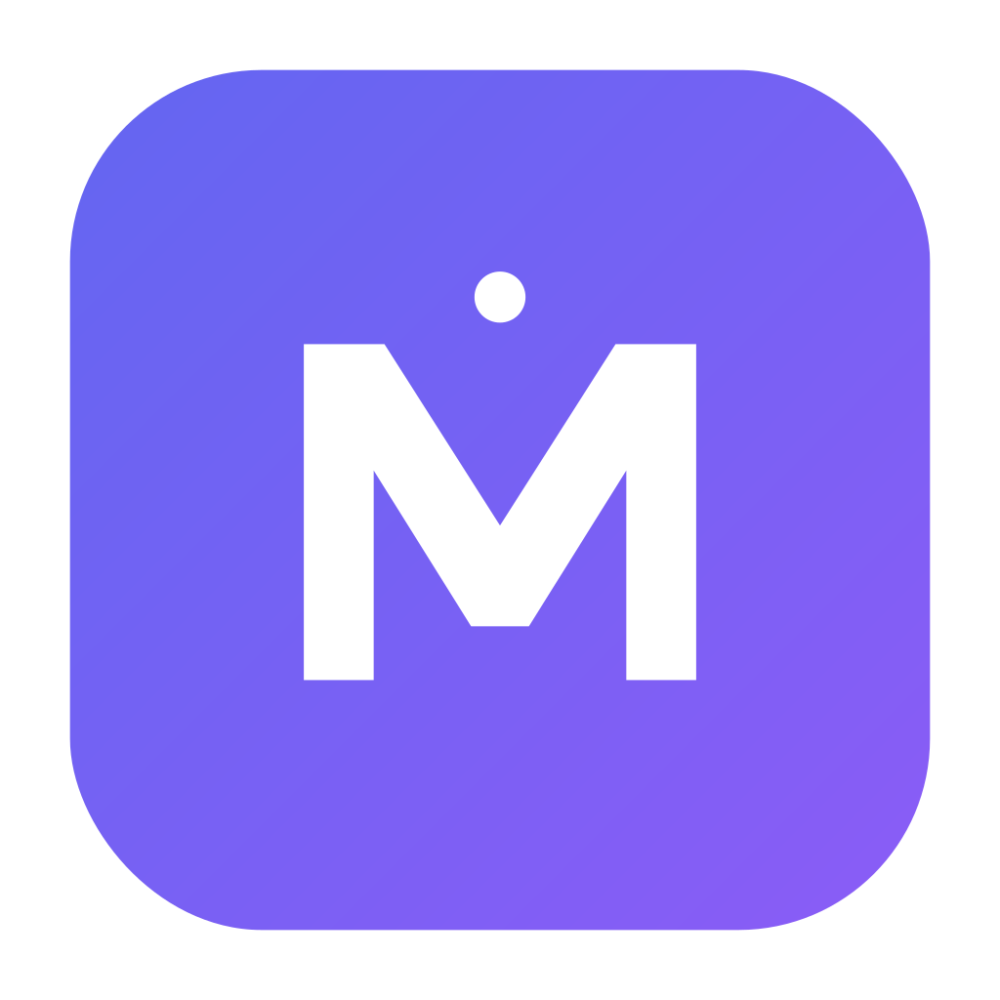

<div align="center">



# MemRE

**AI-powered spaced repetition flashcards as a native macOS desktop app.**

[](https://github.com/O6lvl4/memre/actions/workflows/ci.yml)
[](https://github.com/O6lvl4/memre/releases/latest)
[](LICENSE)

</div>

---

## Features

- **🃏 Spaced repetition** — SM-2 inspired scheduler with continuous retention curve
- **🧠 Multi-provider AI** — Ollama (Gemma 4), Anthropic API (Claude Sonnet), Claude Code CLI, deterministic offline stub fallback
- **🎚️ Per-call provider override** — pin Sonnet for one card-generation pass without changing your default
- **♻️ Hot-reload settings** — switch providers / paste an API key, no restart
- **📚 Knowledge sources** — paste a study text and have AI extract cards from it (FractoP-comprehensive mode for long content)
- **🔌 Local-first** — SQLite at `~/Library/Application Support/Memre/memre.db`. API keys never leave the machine
- **🪟 Native macOS** — single 15 MB `.app` bundle, no Electron, no Chromium

## Install

Download the latest signed `.app` from **[Releases](https://github.com/O6lvl4/memre/releases/latest)**:

```bash
# Apple Silicon
curl -L -o MemRE.zip https://github.com/O6lvl4/memre/releases/latest/download/memre-v0.1.3-darwin-arm64.zip
unzip MemRE.zip
mv memre.app /Applications/
xattr -dr com.apple.quarantine /Applications/memre.app   # ad-hoc signed only
open /Applications/memre.app
```

Then click the **gear icon** in the header to choose an AI provider.

## AI providers

| Provider | Auth | Default model | Cost |
|---|---|---|---|
| **Ollama** | none — local daemon | `gemma4:26b` (or any tag installed) | free, runs on your machine |
| **Anthropic API** | API key | `claude-sonnet-4-6` | per-token (your account) |
| **Claude Code CLI** | none — uses existing `claude` session | `claude-sonnet-4-6` | included in your Claude subscription |
| **Local stub** | n/a | offline fallback | free, low quality (sentence splitter) |

Settings are stored locally in SQLite. The Anthropic key is plain text in the same DB; never sent anywhere except `api.anthropic.com`. Claude Code provider shells out to your `claude` binary so authentication is delegated to that.

## Architecture

```
internal/
├── deck/           bounded context: entity + service + repo + sqlite + Wails handler
├── card/
├── knowledge/
├── ai/             Provider port + Ollama / Anthropic / ClaudeCode / Stub + Registry
├── settings/       KV store, hot-reload backend
├── srs/            pure SM-2 / retention math
├── platform/
│   ├── sqlite/     shared connection + idempotent migrations
│   ├── clock/      Clock interface + System + Fake (for tests)
│   └── idgen/      Generator interface + Crypto + Sequential
└── composition/    composition root — only place adapters meet ports
```

**2026 Go DDD** style: vertical slice (one bounded context per directory), consumer-side `Repository` interfaces, `Service` structs with methods, no separate `domain/application/infrastructure/` layer dirs. Tests substitute fakes in-package without any DI framework.

## Quick start (development)

Requirements: Go 1.25+, Node 20+, Xcode CLT, [`wails3`](https://v3.wails.io) CLI.

```bash
git clone https://github.com/O6lvl4/memre
cd memre

# install deps + generate Wails TS bindings
cd frontend && npm ci && cd ..
wails3 generate bindings -ts

# run with hot reload
wails3 dev

# or build a production .app bundle
wails3 task darwin:package
open bin/memre.app
```

### Tests

```bash
go test -race -count=1 -cover ./internal/...
```

| Package | Coverage | Notes |
|---|---|---|
| `srs` | 90% | pure SM-2 + retention math, table-driven |
| `deck` | 85% | entity invariants + service + sqlite roundtrip |
| `knowledge` | 73% | + ON DELETE CASCADE, FK enforcement |
| `card` | 66% | + ApplyReview, IsDue, upsert |
| `ai` | 52% | Ollama/Anthropic via httptest, Registry resolve, Fallback |
| `settings` | 60% | KV roundtrip, upsert |
| `platform/clock` | 100% | |
| `platform/idgen` | 94% | |
| `platform/sqlite` | 36% | migration + WAL/foreign_keys pragmas + idempotency |

≈110 unit + integration tests, all run on every CI pipeline.

### Custom providers / models

```bash
# pick a different Ollama model
MEMRE_OLLAMA_MODEL=gemma4:e4b open bin/memre.app

# point at a remote Ollama
MEMRE_OLLAMA_URL=http://192.168.1.50:11434 open bin/memre.app

# or set defaults via the in-app gear icon (persists in SQLite)
```

## Releasing

A `git push` of an annotated tag `vX.Y.Z` triggers `.github/workflows/release.yml`, which builds on `macos-latest`, ad-hoc signs the `.app`, zips it, computes SHA-256, and attaches both to a GitHub Release with auto-generated notes.

```bash
git tag -a v0.2.0 -m "..."
git push origin v0.2.0
```

## CI

`.github/workflows/ci.yml`:
- **Linux**: `go vet` + `go test -race -cover` on the pure layer (no Wails GUI deps)
- **Linux**: frontend `tsc -b && vite build` after generating TS bindings
- **macOS**: full graph `go vet ./...` + `.app` smoke test + binary artifact upload

## Roadmap

- [ ] **Streaming AI responses** (token-by-token rendering for long generations)
- [ ] **macOS Keychain** for the Anthropic API key (currently SQLite plaintext)
- [ ] **Apple Developer ID** signing + notarisation (Gatekeeper friction-free install)
- [ ] **Universal binary** (arm64 + amd64) and **Linux** / **Windows** builds
- [ ] **Auto-update** (check GitHub Releases on launch)
- [ ] **Import / export** Anki `.apkg` and CSV
- [ ] **Slog** structured logging + per-call AI metrics

## License

[MIT](LICENSE) © 2026 MemRE contributors
